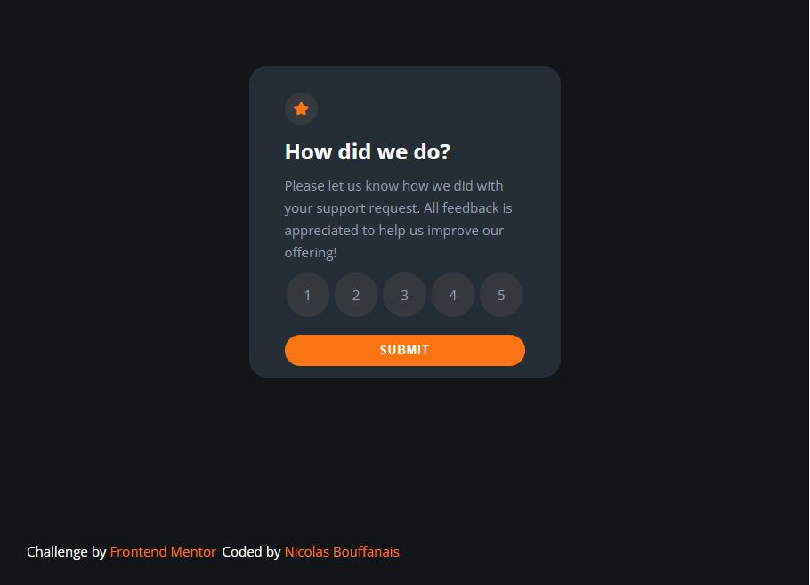

# Frontend Mentor - Interactive rating component solution

This is a solution to the [Interactive rating component challenge on Frontend Mentor](https://www.frontendmentor.io/challenges/interactive-rating-component-koxpeBUmI). Frontend Mentor challenges help you improve your coding skills by building realistic projects. 

## Table of contents

- [Overview](#overview)
  - [The challenge](#the-challenge)
  - [Screenshot](#screenshot)
  - [Links](#links)
- [My process](#my-process)
  - [Built with](#built-with)
  - [What I learned](#what-i-learned)
  - [Continued development](#continued-development)
  - [Useful resources](#useful-resources)
- [Author](#Author)

## Overview

### The challenge

Users should be able to:

- View the optimal layout for the app depending on their device's screen size
- See hover states for all interactive elements on the page
- Select and submit a number rating
- See the "Thank you" card state after submitting a rating

### Screenshot



### Links

- Solution URL: [interactive-rating-component-main](https://github.com/N-Ignacio-Bouffanais/interactive-rating-component-main)
- Live Site URL: [Interactive-rating-component](https://n-ignacio-bouffanais.github.io/interactive-rating-component-main/)

## My process

### Built with

- Semantic HTML5 markup
- CSS custom properties
- Flexbox
- CSS Grid
- JavaScript

### What I learned

To see how you can add code snippets, see below:

```css
.container .level p:hover{
    background-color: var(--Light-Grey);
    color: var(--White);
}
.container .level p:active{
    background-color: var(--Orange);
}
```
```js
function Submit(){
    event.preventDefault();
    let y = document.getElementById("rating")
    y.style.display = "none"
    let x = document.getElementById("result")
    x.style.display = "block"
}
function LevelSelect(element) {
  let one = document.getElementById("1")
  element == one ? (one.style.color = color_sel, one.style.backgroundColor = bgcolor_sel) : (one.style.color = color_unselect, one.style.backgroundColor = bgcolor_unselect)
}
```

### Continued development

I want to continue learning and making projects with javascript, css and html, and over time add tools like Eslint, reactjs, nextjs or maybe vuejs, sass, among others.

## Author

- Website - [Nicolas_Bouffanais](https://n-ignacio-bouffanais.github.io/Nicolas_Bouffanais/src/)
- Frontend Mentor - [@N-Ignacio-Bouffanais](https://www.frontendmentor.io/profile/N-Ignacio-Bouffanais)
- Twitter - [@N_Bouffanais](https://twitter.com/N_Bouffanais)

